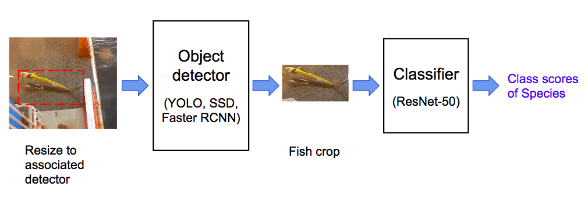

## The Nature Conservancy Fisheries Monitoring

----
https://www.kaggle.com/c/the-nature-conservancy-fisheries-monitoring

#### Task
Given a training dataset of 3792 images and testing dataset of 13153 images taken from fixed cameras mounted on fish boats. The task is to build algorithms to automatically detect and classify the species of fish in the image, and evaluated by log loss of classes.

#### Solution
The task cannot be directly solved by a CNN classifier. The problem is most of the camera images contain rather complicated environment yet the fish is rather small within an image. Thus we need a fish object detector. Another challenge is the data is quite small and imbalanced for each species class. Therefore it's hard for the detector to directly do classification. So the effective way is that firstly build a fish detector (fish or not), then crop the window with only fish from the image, and finally train a classifier from these cropped images. The process is as follows  
   

#### Architecture
Detectors:  
1.[Faster-RCNN](https://arxiv.org/abs/1506.01497): modified from [maskrcnn-benchmask](https://github.com/facebookresearch/maskrcnn-benchmark).  
2.[SSD](https://arxiv.org/abs/1512.02325): VGG16 based SSD, thanks to [sgrvinod's great tutorial](https://github.com/sgrvinod/a-PyTorch-Tutorial-to-Object-Detection).  
3.[YOLO-v3](https://arxiv.org/abs/1804.02767): originated from [pjreddie](https://pjreddie.com/darknet/yolo/); train by the code from [AlexeyAB](https://github.com/AlexeyAB/darknet).  

Performance in downstream task: 1 > 2 > 3.  

Classifier: ResNet-50

The performance results may depend on different model architecture and many hyperparameters - batch size, lr schedule, training steps etc.

### Dependencies
Pytorch 1.0.1
